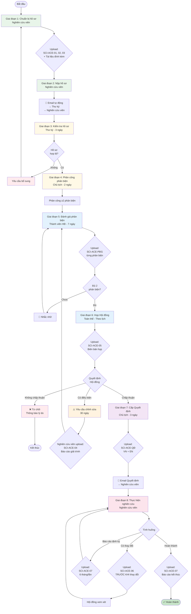
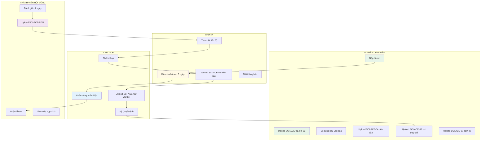
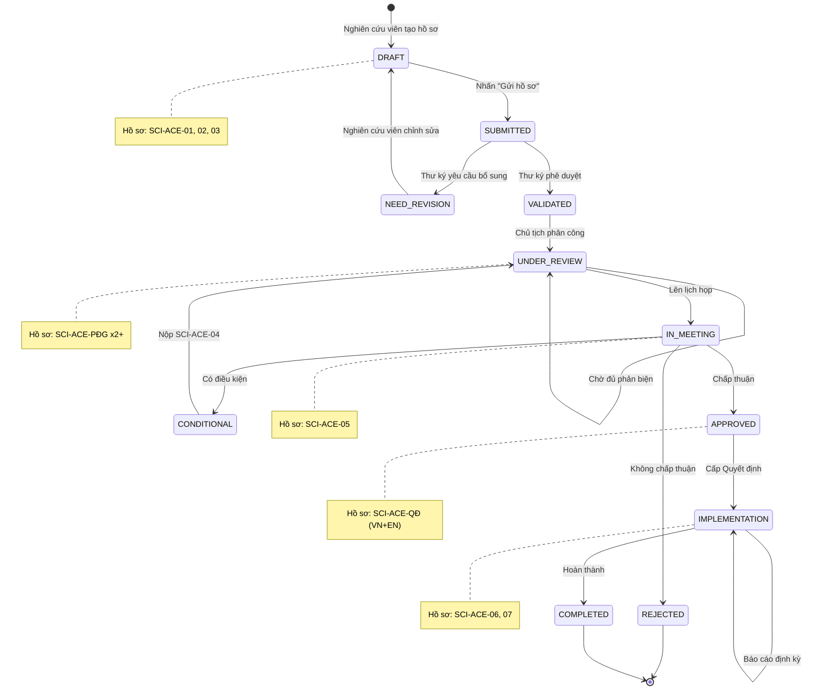
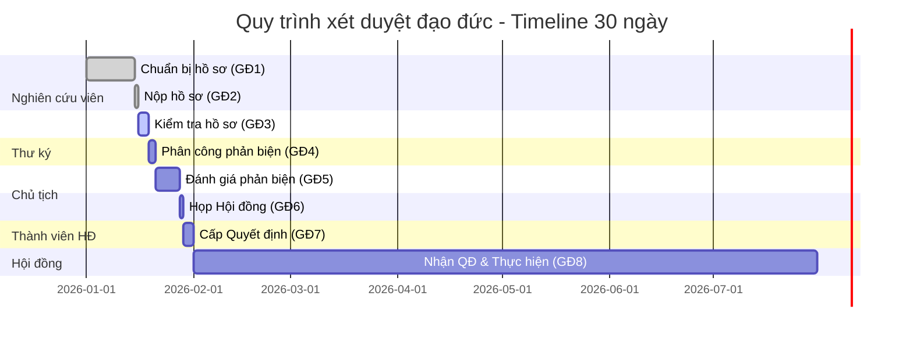
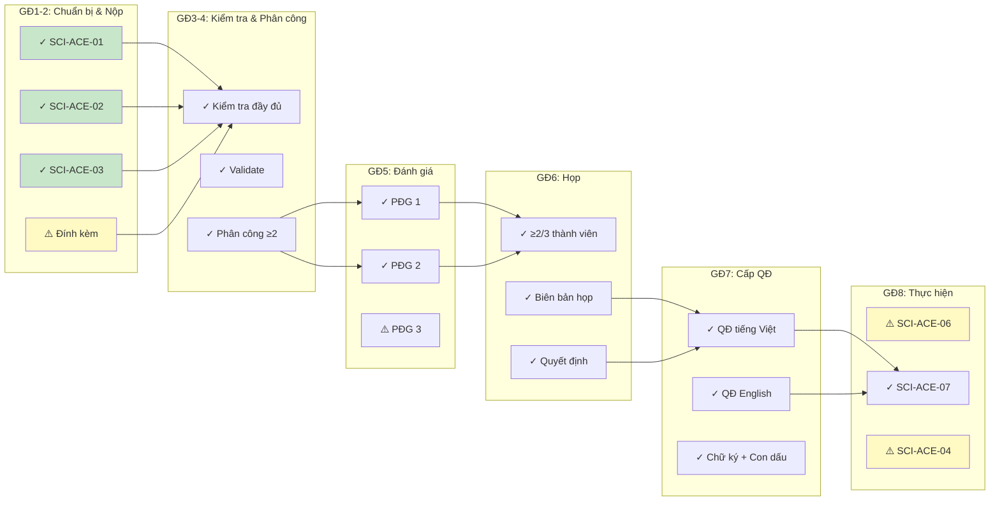
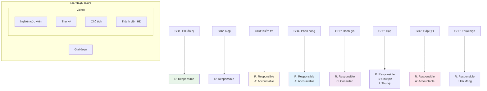

# SƠ ĐỒ QUY TRÌNH UPLOAD HỒ SƠ - SCI-ACE

## 1. SƠ ĐỒ TỔNG QUAN QUY TRÌNH

## 2. SƠ ĐỒ VAI TRÒ VÀ TRÁCH NHIỆM

## 3. SƠ ĐỒ TRẠNG THÁI HỒ SƠ

## 4. TIMELINE QUY TRÌNH (GANTT CHART)

## 5. SƠ ĐỒ CHECKLIST THEO GIAI ĐOẠN

## 6. MA TRẬN TRÁCH NHIỆM (RACI)

**Chú thích RACI:**
- **R (Responsible)**: Người thực hiện trực tiếp
- **A (Accountable)**: Người chịu trách nhiệm cuối cùng
- **C (Consulted)**: Người được tham vấn
- **I (Informed)**: Người được thông báo

---

*Các sơ đồ này có thể được render bằng Mermaid Live Editor hoặc tích hợp vào các công cụ như Notion, GitHub, GitLab.*

**Lưu ý:** Copy các đoạn code Mermaid vào https://mermaid.live để xem trực quan.
