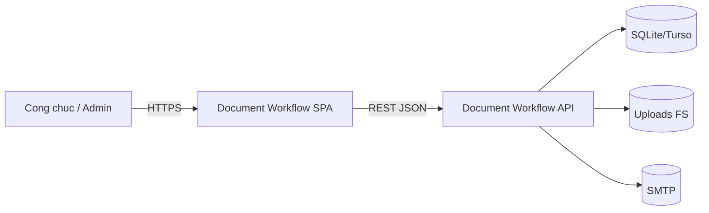
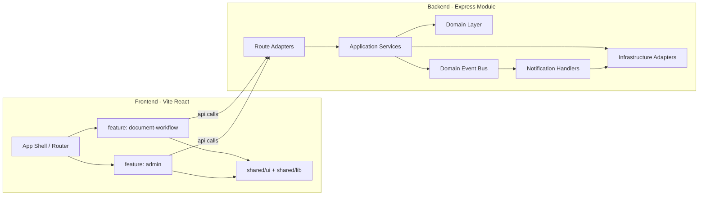
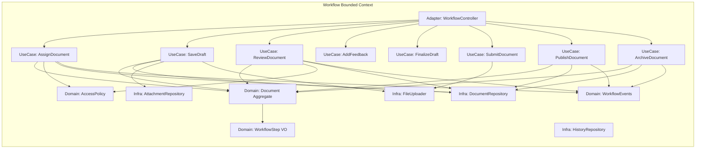
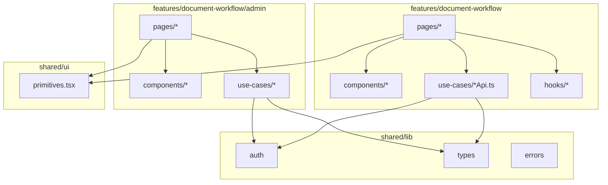

# Document Workflow - Target Architecture v2

Tai lieu nay mo ta kien truc muc tieu (Target v2) cho module Document Workflow, kem migration map chuyen tu trang thai hybrid hien tai sang DDD clean hoan toan. Cac thu tu refactor duoc sap xep de giam rui ro, giu he thong chay lien tuc tren production.

## 1. Bounded Contexts (BC)

- **Workflow BC (core)**: quy trinh 9 buoc tao/phan cong/soan thao/review/hoan thien/submit/publish/archive.
- **Admin BC**: user, role, permission theo module, audit log.
- **Catalog BC**: unit, document_type, module settings.
- **Notification BC**: email template, recipient resolver, event subscription.
- **Shared Kernel**: auth, role parsing, error types, id value objects.

Moi BC co domain rieng, application service rieng, va infrastructure adapter rieng. Cross-context chi giao tiep qua:
- domain event (in-process bus)
- application service interface (khong goi thang repository khac BC)

## 2. C4 Model - Target v2

### 2.1 C1 - System Context



### 2.2 C2 - Container (Logic)



### 2.3 C3 - Component (Backend Workflow BC)



### 2.4 C3 - Component (Frontend Feature)



## 3. Layer Responsibilities (target)

### 3.1 Backend

- `domain/`: entity/aggregate + value object + domain events + business rules (pure, no IO).
- `application/`: use-case (command/query), application service, transaction boundary, event publisher.
- `infrastructure/`: repository adapter, file storage adapter, mailer adapter, SQLite/Turso bridge.
- `interfaces/` (hoac `adapters/`): Express controller + route mapping + request/response DTO.

Quy tac:
- Controller chi mapping request/response va goi application service.
- Application service khong goi truc tiep DB, chi goi qua repository interface.
- Domain khong biet Express/SQLite.
- Notification la subscriber cua event bus, khong duoc goi truc tiep trong use-case.

### 3.2 Frontend

- `features/<context>/pages`: layout/route components.
- `features/<context>/components`: UI chuyen biet domain.
- `features/<context>/use-cases`: api client + hook orchestration cho 1 use-case.
- `features/<context>/hooks`: react hooks dac thu feature.
- `shared/ui`: component generic khong biet domain.
- `shared/lib`: auth, types, utilities.
- `app/`: shell, router, provider, theme.

## 4. Bounded Context Mapping

- Workflow BC <-> Notification BC: **Published Language** (WorkflowEvents contract).
- Workflow BC <-> Admin BC: **Customer/Supplier** (Admin cung cap user/role info qua interface, khong expose schema).
- Workflow BC <-> Catalog BC: **Shared Kernel** (unit/doc_type value objects read-only).
- Shared Kernel: auth/parseRoles, id types, error types.

## 5. Migration Map (theo sprint, uu tien giam rui ro)

Moi sprint keo dai ~1 tuan, co the dieu chinh theo luc luong. Moi buoc deu:
- giu route cu khong vo
- chi them layer, chua xoa, cho den khi guardrail CI xanh 2 lan lien tiep

### Sprint 0 - Baseline & Safety Net
- Fix lai 2 warning `react-hooks/exhaustive-deps` con lai.
- Them smoke e2e test toi thieu: create -> assign -> publish -> archive.
- Chup baseline metric: bundle size, response time chinh, error rate.
- Khoa deadline deprecation `2026-06-30` trong calendar.

### Sprint 1 - Backend Domain Carve-out
- Tao `modules/document-workflow/domain/` voi `Document` aggregate, `WorkflowStep` VO.
- Di chuyen validation tao ho so + chuyen buoc ra domain (khong dung DB).
- Controller van goi `DocumentModel`, chi rut validation sang domain.
- **Risk**: thap, chi di chuyen code pure.

### Sprint 2 - Application Service cho Command use-case
- Tao `application/document/DocumentWorkflowService` voi cac method: `assign`, `saveDraft`, `review`, `addFeedback`, `finalize`, `submit`, `publish`, `archive`.
- Controller chuyen tu `controller.method(req,res)` sang `service.method(command)` + mapping DTO.
- Van dung `DocumentModel` phia duoi.
- **Risk**: trung binh, nen refactor tung command mot, chay regression checklist tuong ung.

### Sprint 3 - Repository Split theo Bounded Context
- Tach `infrastructure/repositories/` thanh: `DocumentRepository`, `UnitRepository`, `UserAdminRepository`, `SettingsRepository`, `AuditLogRepository`.
- Moi repo wrap `DocumentModel` hoac truy cap db truc tiep cho query rieng.
- Application service nhan repository qua DI, khong cham `DocumentModel` nua.
- **Risk**: trung binh, doi hoi contract test cho tung repo.

### Sprint 4 - Domain Events & Notification BC
- Tao `application/events/DomainEventBus` (in-process pub/sub).
- Dinh nghia `domain/events/WorkflowEvents`.
- Tao `application/notifications/WorkflowNotificationHandler` subscribe vao event bus.
- Chuyen logic email tu controller/service sang handler.
- **Risk**: trung binh-cao, vi lien quan side effect. Bat buoc regression email toggle.

### Sprint 5 - Controller Slim Down
- Controller chi con parse request + goi service + serialize response.
- Bo helper business khoi controller.
- **Risk**: thap (chu yeu di chuyen).

### Sprint 6 - Frontend Feature Carve-out
- Tao `features/document-workflow/{pages,components,use-cases,hooks}`.
- Di chuyen `DocumentListPage`/`DocumentDetailPage`/`StepForms`/`AttachmentUploader` sang `features/document-workflow/*`.
- Giu `pages/*` bang re-export tam thoi (co comment deadline).
- Cap nhat App.tsx import tu feature.
- **Risk**: thap, da co CI guardrail chan path cu.

### Sprint 7 - Frontend Admin Carve-out
- Tao `features/document-workflow/admin/{pages,components,use-cases}`.
- Di chuyen `AdminLayout`, `AdminDashboardPage`, `UserManagementPage`, `UnitsManagementPage`, `ModulePermissionsPage`, `ModuleSettingsPage`, `AuditLogsPage`, `EmailNotificationsPage`.
- Di chuyen `AdminGuard` vao `features/document-workflow/admin/components/AdminGuard`.
- **Risk**: thap.

### Sprint 8 - Shared UI Hardening
- Tao `shared/ui/primitives.tsx` voi cac component generic (DataTable, Pagination, Tabs, Toast, Dialog).
- Tao `features/document-workflow/admin/components/AdminCards.tsx` cho admin-specific card.
- Xoa bo `components/admin/AdminPrimitives` khoi code, giu shim chi khi con nguoi dung.
- **Risk**: trung binh, do `components/admin/AdminPrimitives` dung o nhieu noi.

### Sprint 9 - Frontend API Layer Split
- Tach `src/lib/api.ts` thanh:
  - `features/document-workflow/use-cases/documentWorkflowApi.ts`
  - `features/document-workflow/use-cases/adminWorkflowApi.ts`
- `src/lib/api.ts` tro thanh facade re-export, roi xoa han o sprint sau.
- **Risk**: thap.

### Sprint 10 - Hard Deprecate & CI Guardrails
- Viet deprecation note + deadline.
- Cau hinh ESLint `no-restricted-imports` chan path cu.
- Them CI workflow `document-workflow-guardrails.yml` (grep import + lint + build + PR checklist).
- Them PR template bat buoc tick regression & guardrail.
- **Risk**: thap.

### Sprint 11 - Release Chotting
- Chay `regression checklist` va `merge checklist`.
- Release note + changelog + rollback plan.
- Merge.

### Sprint 12 - Post-Release Cleanup (sau deadline 2026-06-30)
- Xoa `components/admin/AdminPrimitives.tsx`.
- Xoa `components/admin/AdminGuard.tsx`.
- Xoa `pages/admin/*` re-export layer.
- Xoa `src/lib/api.ts` neu chi con facade.
- Xoa `routes/internalDocumentsWorkflow.js` bridge neu khong con ai goi.
- **Risk**: thap, guardrail da chan truoc.

## 6. Thu tu Refactor Uu tien (rui ro thap -> cao)

1. Sprint 0 - safety net (rui ro rat thap, bat buoc truoc).
2. Sprint 6-9 - frontend boundary (da co CI guardrail ho tro, khong anh huong DB).
3. Sprint 1-2 - backend domain + application service, giu DocumentModel.
4. Sprint 3 - tach repository (sau khi application service da on dinh).
5. Sprint 4 - event bus + notification (rui ro cao nhat, lam sau cung trong backend).
6. Sprint 5 - slim controller.
7. Sprint 10-11 - gating va release.
8. Sprint 12 - cleanup sau deadline.

Nguyen tac: **UI boundary truoc, backend layering sau, side effect cuoi cung**. Vi UI boundary khong anh huong du lieu, con side effect (mail/audit) cham vao production state.

## 7. Risk Register (theo hang muc)

- **Permission regression**: khi di chuyen logic role vao middleware/domain, de quen edge case reviewer step 4 hoac internal domain viewer.
  - Mitigation: giu nguyen `documentPermissionMiddleware` qua sprint 1-5, chi tach doc ro, khong doi behavior.
- **Email side effect**: notification tach event bus co the bi mat email hoac gui trung.
  - Mitigation: viet integration test gui mail duoc mock, kich hoat tung event lan luot o sprint 4.
- **Schema drift**: `DocumentModel.ensureSchema` dang gan chat voi bootstrapping.
  - Mitigation: chuyen logic ensureSchema sang migration runner doc lap o sprint 3 truoc khi tach repo.
- **Frontend boundary drift**: developer moi quen path cu.
  - Mitigation: CI guardrail + PR template + deprecation deadline.
- **Long-running SPA mount**: admin SPA auto-build trong server.js co the fail silent.
  - Mitigation: giu `/admin-ui-status` endpoint va monitor sau release.

## 8. Definition of Done cho "DDD Clean"

- Khong con logic nghiep vu trong controller Express.
- Khong con model lon kieu `DocumentModel` chua nhieu bounded context.
- Moi side effect (mail, audit) di qua domain event bus.
- Frontend khong con path `components/admin/AdminPrimitives`, `pages/admin/*`, `components/admin/AdminGuard`.
- Moi use-case trong workflow co 1 application service method tuong ung, test duoc doc lap.
- CI guardrails active va xanh.
- Checklist regression + merge checklist da ky.

## 9. Folder Layout Target (cheatsheet)

```
modules/document-workflow/
  domain/
    document/
      Document.js
      WorkflowStep.js
      AccessPolicy.js
    events/
      WorkflowEvents.js
  application/
    document/
      DocumentWorkflowService.js
      use-cases/
        AssignDocument.js
        SaveDraft.js
        ReviewDocument.js
        AddFeedback.js
        FinalizeDraft.js
        SubmitDocument.js
        PublishDocument.js
        ArchiveDocument.js
    admin/
      UserAdminService.js
      UnitService.js
      SettingsService.js
      AuditLogService.js
    events/
      DomainEventBus.js
    notifications/
      WorkflowNotificationHandler.js
  infrastructure/
    repositories/
      DocumentRepository.js
      AttachmentRepository.js
      HistoryRepository.js
      UnitRepository.js
      UserAdminRepository.js
      SettingsRepository.js
      AuditLogRepository.js
    storage/
      FileUploader.js
    mail/
      WorkflowMailer.js
  interfaces/
    http/
      documentWorkflowController.js
      documentWorkflowAdminController.js
      routes.js

frontend/document-workflow-ui/src/
  app/
    App.tsx
    main.tsx
    router.tsx
  features/
    document-workflow/
      pages/
      components/
      use-cases/
      hooks/
      admin/
        pages/
        components/
        use-cases/
  shared/
    ui/
      primitives.tsx
    lib/
      auth.ts
      types.ts
      errors.ts
```

## 10. Tracking

- Mo 1 epic "Document Workflow DDD v2" tren tracker.
- Moi sprint la 1 story lon, co checklist con.
- Moi khi hoan thanh sprint:
  - chay regression checklist muc lien quan
  - cap nhat migration map nay neu co thay doi scope.
